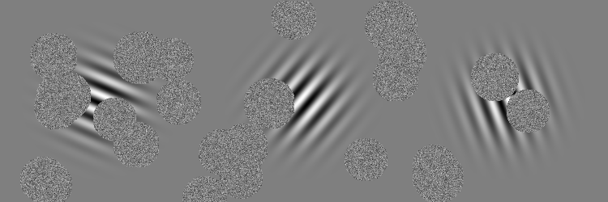
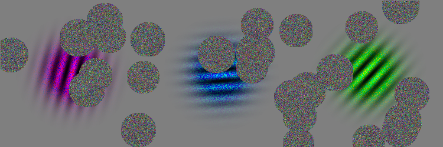

# Gabor Patches Image Generator

This repo contains the scripts I have used to generate the data I have used for my semester thesis as well as a very small sample dataset. The purpose of the work was to investigate the behavior of attention-constrained networks making decisions. The work in my thesis is based on the work of Mnih et al. [1], but is not (yet) published.


## Grayscale Images

Use the following command to generate 50 images containing three gabor patches each and having 25 patches filled with gaussian noise on it. The metadata of the images (the orientations of the patches) are saved in a separate file called `description.csv` in the same folder as the images.

```python gs_data_generator.py --n_gabor_patches 3 --n_noise_patches 25 --output_path images/grayscale/ --n_images 50```





## Color Images

Use the following command to generate 50 images containing three colored gabor patches each and having 25 patches filled with gaussian noise on it. The metadata of the images (the orientations of the patches as well as the color angle (cf. HSV color model)) are saved in a separate file called `description.csv` in the same folder as the images.

```python c_data_generator.py --n_gabor_patches 3 --n_noise_patches 25 --color_noise 30 --output_path images/color/ --n_images 50```





[1] V. Mnih, N. Heess, A. Graves, and K. Kavukcuoglu, "Recurrent models of visual attention", 2014, http://arxiv.org/abs/1406.6247